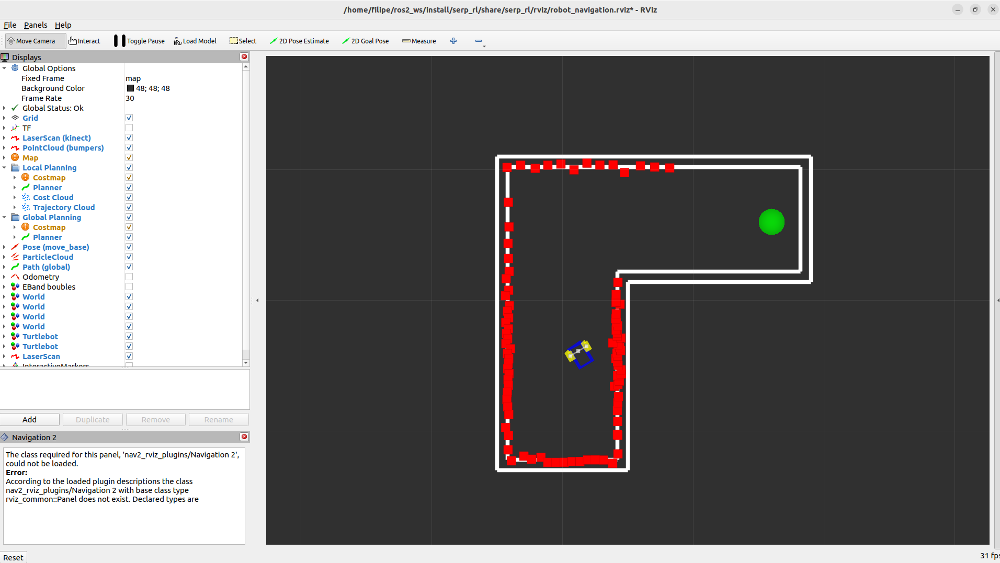

# Flatland Reinforcement Learning Tutorial using ROS 2

The [previous tutorial](https://github.com/FilipeAlmeidaFEUP/ros2_teleopkeys_tutorial) focused on explaining how to use ROS 2 and Flatland to create a robot and control it. In this tutorial you will learn how to use Reinforcement Learning (RL) inside the same setup to teach the robot how to perform a simple task. The packages used for the RL algorithms are the [Stable-Baselines3](https://stable-baselines3.readthedocs.io/en/master/) and OpenAI's [Gym](https://www.gymlibrary.dev/).

## First Run

### Pre-requisites

All the prerequisites are carried over from the prvious tutorial. In addition you also neet to install the Stable-Baselines3 package. Follow the [installation guide](https://stable-baselines3.readthedocs.io/en/master/guide/install.html) from the documentation. For this example you can install the most basic version either for [Windows](https://stable-baselines3.readthedocs.io/en/master/guide/install.html#windows-10) or using [pip](https://stable-baselines3.readthedocs.io/en/master/guide/install.html#stable-release) for other OS's.

The Stable-Baselines3 installation should automatically install all missing depencencies, including the Gym package. Nevertheless, pay attention during the installation and make sure there were no errors. If any dependency fails to install try to do it manually.

### Running the code

Clone the repository to your `<ros2_workspace>/src` folder:
```
git clone https://github.com/FilipeAlmeidaFEUP/ros2_flatland_rl_tutorial.git
```

Build the project and install dependencies:
```
rosdep install -i --from-path src --rosdistro humble -y
colcon build
source install/setup.bash
```

Run the launch file:
```
ros2 launch serp_rl serp_rl.launch.py
```

At this point, if no errors occur, you should be seeing the following world:



The robot is currently using the Proximal Policy Optimization (PPO) algorithm to learn how to navigate the hallway from one end to the other. In the begining, the robot is just exploring the environment and practically taking random actions. Over time, it starts to learn what to do in the different scenarios and it will improve at the task.

The target area is represented by the green circle and, every time the task is restarted, the initial and final positions swap so the robot learns how to turn to both the left and the right. The task is restarted if it fails if there is any collisions or it takes too much time) or if it succeeds (reaches the end).

These are all the components in the world and how they changed from the previous tutorial:
- Map: now is a simpler layout, representing a hallway with a 90º turn. Same configuration with a different [image](world/turn.png).
- SERP robot model with LiDAR: this model is exactly the same from before.
- End Beacon: new model added to detect if the SERP robot reached the end. It's represented by a green circle and its body has no collision with any other component. 
- End Beacon LiDAR: laser plugin inside the end beacon model that ignores walls and only detects the SERP robot. The smallest value read is the distance from the robot to the end and, if bellow a threshold, the target area was reached.

NOTE: The layers were setup in order to accommodate for the necessary collisions and lasers. If you're having trouble understanding the logic, revisit the [slideshow on how to manage layers](https://github.com/FilipeAlmeidaFEUP/ros2_teleopkeys_tutorial/blob/main/layers_ppt/Managing_Layers_in_Flatland.pdf). The last slide shows the layer graph for this world.

The next sections will explain how the code from the controller needs to be organized to use any RL algorithm provided by Stable-Baselines3.

## Setup the Environment

Important definitions before you start:
- RL Agent: component that decides what action to take based on the state of its environment.
- RL Environment: contains information about all possible actions for every state and the respective reward (how good the action is for any given state).


Every RL algorithms have the same goal: find the best action for the agent to take to every possible state of the environment. The first step to use RL in robotics (also known as Robot Learning) is to turn the robot (and its sensors) and the map in the environment for the agent to use. 

This is exactly what the OpenAI's Gym package allows us to do with an `Env` class that can be inherited. In this package, we can reuse the node class:
```
from gym import Env

class SerpControllerEnv(Node, Env):
  [...]
```

This will then allow us to use variables and override functions that define the environment. Next sections will explain how to configure this environment but you can also check the documentation on [how to make your own custom environment](https://www.gymlibrary.dev/content/environment_creation/).

### \_\_init\_\_ fuction

Inside the init function you need to initialize the `action_space`, `observation_space` and `state` variables. 

Lets start by choosing the actions the robot can perform. For this project, there are seven possible actions, executable by changing the robots linear and angular velocity:
1. Stopped
2. Move Forward
3. Move Backwards
4. Rotate Left
5. Rotate Right
6. Move Forward and Rotate Left
7. Move Forward and Rotate Right

Then we need to choose what a state of our environment looks like (the `observation_space`). For that we'll use the readings from the LiDAR. Since using all 90 rays would give a state space too large that would take to long for the agent to train in, we need to sample the readings. To do that, The LiDAR was divided into 9 equal sections and from each we get the closest reading. This means that our observation space is composed of 9 floating point values.

NOTE: In more conventional definitions of a state in RL, the agent has total knowledge of the environment (position of all entities, shape of the map, etc.). In this case (and a lot of other Robot Learning applications), the agent can only know what the robot knows, which is the LiDAR readings.

To actually initialize the variables, we need to define their shape using [Gym Spaces](https://www.gymlibrary.dev/api/spaces/). For this project, these shapes are used:
```
from gym.spaces import Discrete, Box

# action is an integer between 0 and 6 (total of 7 actions)
self.action_space = Discrete(7)

# state is represented by a numpy.Array with size 9 and values between 0 and 2
self.observation_space = Box(0, 2, shape=(9,), dtype=numpy.float64)

# after the observation spaceis defined, you can declare the initial state 
self.state = numpy.array(self.lidar_sample)
```

### step fuction

In RL a step is the process that is constantly being repeated and consists of:
1. Receiving the action decided by the agent for the current state and executing it.
2. Determining the new state.
3. Calculate the reward based on the old and new states and the action.
4. Check if a final state was reached and the environment needs to be reset.

In the code for this package this equates to:
1. Changing the robot speed based on the action chosen.
2. Wait for the action to be completed. In this case the action finishes when the next LiDAR reading is published. This means each step lasts the same as the update rate of the LiDAR, 0.1 seconds.
3. The reward is 0 unless the task is failed (collisions or time out) or completed (end reached), giving a negative or positive reward respectively.
4. Determines if it is a final state based on events from subscribed topics during the action (collisions or end reached) or the number of actions already taken (times out at 200 steps).

Returns: The current state, the reward and if it reached a final state (boolean). 

NOTE: As this example was for demonstration purposes, the function that calculates the reward was left very simple. A good exercise for you would be to think of other things that can be added to help the robot complete the task. Hint: take advantage from all information available, like old and new lidar readings and the action taken.

### reset fuction

An episode, in the context of RL, is the set of steps between an initial state ans a final state. The reset function has the task of starting a new episode by setting the environment back to an initial state. In this case this means:
- Placing all the models (SERP and End beacon) in starting positions.
- Resetting all variables that need to.
- Determine the new initial state (next reading from the Lidar).

Returns: The initial state.

### Other functions

- render: Used to render you environment. Not needed here since it is already rendered in Flatland.
- close: Runs when the environment is no longer needed. Can be used to close no longer necessary ROS 2 processes

## Run the RL algorithm

The more recently developed RL algorithms are very effective but also very hard to understand. The good news are that, thanks to the Stable-Baselines3 package, you can completely abstract from how the algorithm works. In fact, if you have a properly setup environment, getting an algorithm to run an agent on it only takes a few lines of code:

```
from stable_baselines3 import PPO
from stable_baselines3.common.env_checker import check_env

env = Env()

# optional but launches exceptions with helpfull messages debug your environment if it has errors
check_env(env)

# create the agent for the PPO algorithm and assigning one of the predefined policies and the environment
agent = PPO("MlpPolicy", env)

# letting the agent learn learn for 25000 steps
agent.learn(total_timesteps=25000)
```

Go to the [documentation](https://stable-baselines3.readthedocs.io/en/master/guide/algos.html) to see all available RL algorithms in this package. Notice that you can swap between algorithms with very few changes to the code.

After the training is complete, you can test your model by manually calling the environment functions:
```
obs = self.reset()
while True:
  # returns an action based on what it learned
  action, _states = agent.predict(obs)
  
  obs, rewards, dones = self.step(action)
```

You can easily store you trained agent to a file and load it later with the functions:
```
agent.save("ppo")
agent = PPO.load("ppo")
```

This code needs to run in parallel with the ROS2 processes so threading was used.
